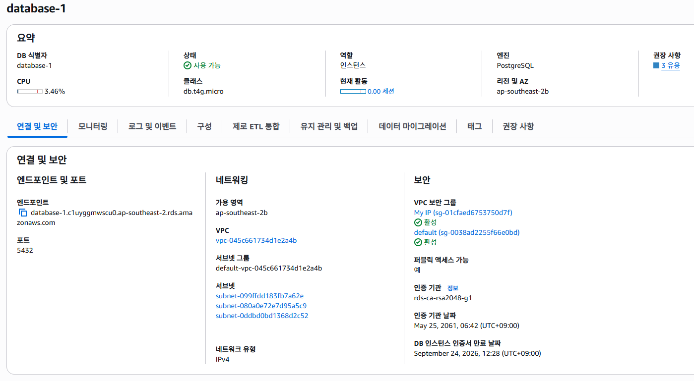
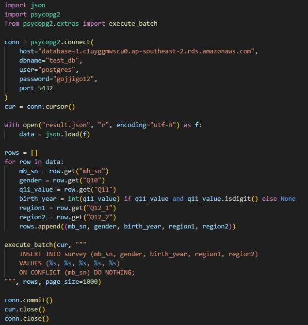

## 목표: FastAPI,EC2,RDS를 이용하여 서버 구축하기

프로젝트 순서(웹 클라이언트 → LLM 해석 → RDS와 비교 → 정확도 계산)

*EC2를 쓰는 이유: 웹 클라이언트를 만들었을 때, 다른 네트워크의 사용자들이 접근하려면 항상 열려 있는 서버가 필요합니다.  이 때 EC2 안에서 FastAPI, 클라이언트를 구현해야합니다.

## 비용

- RDS,EC2 각각 월별 750시간 무료
- 프리티어 인스턴스 유형(t3.micro)로 프로젝트로 충분히 구동 가능

## FastAPI란

- 단순히 웹 요청을 처리하는 서버가 아니라, 비동기 처리를 지원하고 JSON 기반 API 응답을 쉽게
  구성할 수 있어 외부 클라이언트와 데이터 교환에 최적화된 프레임워크입니다.
  즉, 프로젝트에 필요한 LLM 해석, 정확도 계산, 데이터 비교 기능들이 다 FastAPI에서 수행됩니다.

## FastAPI(웹프레임 워크)의 기능

1. 웹 API 서버 역할((ex) 자연어 입력시 FastAPI가 JSON 형태로 받음)
2. LLM 호출(자연어 → 검색 조건 변환)
3. RDS 연동 (이걸로 데이터 비교 후 정확도 계산)

## FastAPI 이용 시 필요 라이브러리

- fastAPI
- Uvicorn: FastAPI 통해 구현한 것을 실행해주는 라이브러리

## Uvicorn에 대해
* Uvicorn은 ASGI, CGI,WSGI들을 베이스로 두고 이해해야합니다.
- CGI 란?
    웹 어플리케이션 서버에 동적인 요청이 들어 왔을 때 그것에 대해 처리하고 응답해줘야 합니다.
    이때 서버마다 언어마다 이 형태가 다르게 된다면 곤란해지므로 어떤 공통 규약(인터페이스를) 만들어야합니다. 이 인터페이스가 CGI입니다.

- WSGI란?
    Web Server Gateway Interface의 약자로, 파이썬에서 사용되는 개념입니다.
    CGI의 단점(요청이 들어오면 새로운 프로세스를 생성하는 메모리 효율 저하)을 보완하는 방법입니다.

- ASGI란?(Asynchronous Server Gateway Interface)
    WSGI의 단점(비동기 처리)에 단점을 보완한 방법 즉 이것은 Uvicorn입니다
 

## EC2

- AWS에서 제공하는 로컬이 아닌 클라우드에서 24시간 동작하는 서버 환경을 제공하는 가상 머신
- 즉 개별용 로컬 서버가 아닌 배포용 클라우드 서버
* vCPU란?
    - EC2 가상 서버이므로 EC2 가상화 소프트웨어를 통해 제공되는 CPU

## EC2 인스턴스 수명주기

* 수명주기: AMI로부터 실행이 되고나서 종료될 때까지 거치는 과정
* AMI: EC2 인스턴스를 생성하기 위한 템플릿(운영체제) (ex) Amazon Linux2, Ubuntu, Window

1. pending state
    - 제일 처음 AMI가 실행이 되는 준비 상태를 말합니다
    EC2를 가동하기 위해서 가상머신, ENI(가상 랜카드),EBS("" 스토리지) 등이 준비되는 과정입니다.

2. running state
    - EC2를 사용할 수 있는 상태

3. shutting-down state
    - 인스턴스 종료 중

4. terminated state 
    - 완전히 종료, 인스턴스 영구 삭제
    * 주의 : 인스턴스를 멈춰도 EBS나 탄력적 IP(고정 퍼블릭 IP)를 연결했을 경우 별도로 청구됩니다.

## RDS

- EC2와 똑같이 AWS에서 제공하는 관리형 관계형 데이터베이스
- 사용자 직접 SQL을 설치,운영할 필요 없이 AWS에서 자동으로 관리합니다. 
- 로컬에서는 컴퓨터가 꺼지면 DB도 종료되지만 RDS는 클라우드라 24시간 작동합니다.

## RDS의 백업 기능

1. 자동백업(AB): AB는 매일 진행됩니다. AB를 통해 1~35일 안의 특정 시간으로 되돌아갈 수 있습니다.  단, 롤백 동작은 과거로 돌아가는 것이 아닌 다른 DB 인스턴스를 새로 생성해서 스냅샷을 적용시키는 형식입니다.

2. 수동백업(SB): AB이 자동으로 스냅샷을 떠서 백업하는 거면 SB는 유저 혹은 프로세서로부터 요청에 따라 만들어지는 DB 스냅샷입니다. 즉, 사용자에 의해 수동으로 백업되는 것입니다.
SB의 예시로 RDS를 삭제하더라도 스냅샷은 S3에 그대로 존재합니다. 그러므로 스냅샷만으로 RDS 인스턴스를 복구 할 수 있습니다. 반대로 AB는 인스턴스를 삭제할 때 스냅샷도 모두 삭제됩니다.

## PostgreSQL가 적합한 이유

1. 관계형 데이터베이(데이터가 명확히 구조화)라서 SQL로 쉽게 질의 가능[조건 검색에 최적화]
2. SQL 표준을 가장 따르는 DB 중 하나 -> “정확도 계산”처럼 집계나 통계성 연산이 필요할 때 유리합니다.
3. AWS RDS에서 공식 지원

## RDS구현(데이터베이스)

1. 생성한 RDS

 * 중요한 점 : EC2가 접근 할 수 있도록 보안 그룹에는 EC2 인스턴스의 IP를 추가해야함

2. "result.json" 데이터를 python을 통해 RDS에 기입
 * rds 데이터베이스의 엔드포인트, db이름, 비번, 유저를 등록해서 연동 
 * 태그를 좀 더 보이 좋게 Q11, Q12 등이 아닌 지역,성별, 생일로 바꾸기
 * psql INSERT 명령어로 데이터 기입
 

3. cms로 확인하기
* psql -h database-1.c1uyggmwscu0.ap-southeast-2.rds.amazonaws.com  -p 5432 -U postgres  -d postgres <= psql -h <엔드포인트> -p <포트번호> -U <유저이름> -d <DB이름>

## ec2에서 RDS 연동

* 보안그룹 설정을 0.0.0.0/0으로 할 시 보안에 위험이 있어 아래처럼 설장함으로써 RDS에 EC2만 접속할 수 있습니다.

1. RDS에 EC2 보안그룹 ID 넣기

2. EC2에서 RDS 연결 확인

## 다음주 프로젝트 계획

1. 클라이언트에서 보낸 자연어를 처리할 LLM 모델 FastAPI에 적용 
2. EC2에서 간이 웹 클라이언트 구현 후 FastAPI(LLM, 정확도 결과 반환) 적용