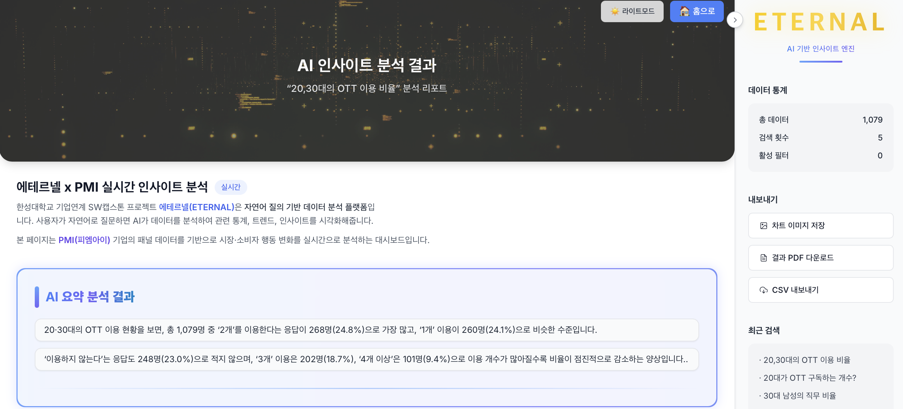
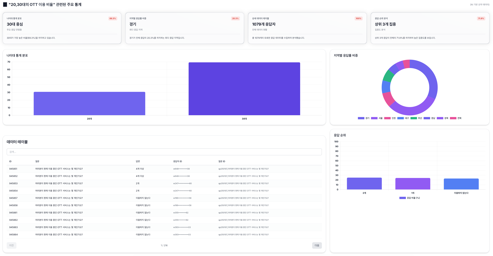
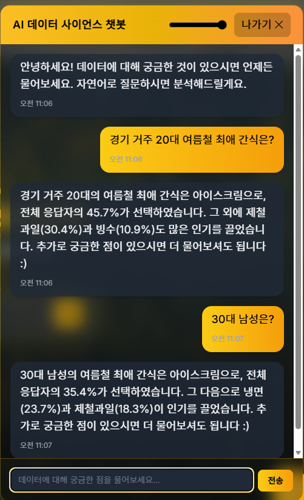

# Eternel

> **25-2 프리캡스톤디자인 | 자연어 질의 기반 데이터 추출 및 시각화 아키텍처**

> 최근 생성형 AI 기술은 다양한 분야에서 활용되고 있지만, 복잡한 패널 데이터를 일반 사용자가 직관적으로 검색하고 분석하는 데는 여전히 어려움이 있습니다.

> Eternel은 **자연어 질의를 통해 누구나 쉽게 패널 데이터를 검색**하고, **AI 기반 분석 결과를 시각화**하여 데이터 인사이트를 발견할 수 있도록 돕는 플랫폼입니다.


---

## 주요 기능

### 1. 자연어 기반 스마트 검색 및 AI 요약 분석

사용자는 "체력 관리", "결혼 상태" 등 일상적인 언어로 질문하면, AI가 관련 패널 데이터를 자동으로 검색하고 요약 분석 결과를 제공합니다.



**주요 특징:**

- **자연어 질의**: 일상 언어로 데이터 검색 가능
- **AI 요약 분석**: 검색 결과에 대한 간결한 인사이트 제공
- **실시간 검색**: 백엔드 API와 연동하여 즉시 결과 반환

### 2. 다양한 데이터 시각화

검색 결과를 다양한 형태의 차트와 테이블로 시각화하여 직관적인 데이터 분석을 지원합니다.



**제공하는 차트:**

- **퀵 차트**: 주요 통계를 한눈에 확인
- **나이대별 통계 분포**: 막대 차트로 연령대별 응답 현황 표시
- **지역별 응답 비중**: 원형 차트로 지역별 분포 시각화
- **데이터 테이블**: 실제 이용자 데이터를 정렬, 페이지네이션하여 제공
- **응답 순위 및 성별 응답률**: 상세 통계 정보 제공

### 3. 스마트 필터링

카테고리, 지역, 나이별 동적 필터를 적용하여 원하는 데이터를 정밀하게 추출할 수 있습니다.

### 4. AI 채팅 인터페이스

검색창 클릭으로 활성화되는 AI 어시스턴트를 통해 데이터에 대한 자유로운 질문이 가능하며, 이전 대화 맥락을 유지하여 연속적인 질의응답을 지원합니다.



**주요 특징:**

- **데이터 기반 대화형 응답**: 패널 데이터를 기반으로 짧고 명확하게 요약하여 대답
- **후속 질문 지원**: 이전 대화 맥락을 유지하여 연속적인 질문 가능
- **스몰톡 처리**: 데이터와 관련 없는 일반 질문은 smalltalk_chat으로 자연스럽게 응대

### 5. 데이터 내보내기

차트 이미지, PDF, CSV 형식으로 분석 결과를 다운로드할 수 있습니다.

---

## 기술 스택

| 영역         | 스택                                                                                                                                                                                                                                                                                                                                                                       |
| ------------ | -------------------------------------------------------------------------------------------------------------------------------------------------------------------------------------------------------------------------------------------------------------------------------------------------------------------------------------------------------------------------- |
| **Frontend** |           |
| **Backend**  |                     |
| **Database** |                                                                                             |
| **DevOps**   |     |
| **LLM**      |       |

---

## 시스템 아키텍처

### 전체 아키텍처

```
┌──────────────────────────────────────────────────────────────────────┐
│                          사용자 (User)                                │
└───────────────────────────┬──────────────────────────────────────────┘
                            │ 자연어 질의
                            ↓
┌──────────────────────────────────────────────────────────────────────┐
│                      Frontend (React App)                            │
│  ┌────────────────────────────────────────────────────────────┐      │
│  │  • React 18 + TailwindCSS                                  │      │
│  │  • Chart.js (데이터 시각화)                                 │      │
│  │  • Framer Motion (애니메이션)                               │      │
│  │  • React Router (페이지 라우팅)                             │      │
│  └────────────────────────────────────────────────────────────┘      │
└───────────────────────────┬──────────────────────────────────────────┘
                            │ HTTP/REST API
                            ↓
┌──────────────────────────────────────────────────────────────────────┐
│                    Backend (FastAPI Server)                          │
│  ┌────────────────────────────────────────────────────────────┐      │
│  │  • FastAPI + Uvicorn (ASGI 서버)                           │      │
│  │  • LangChain (LLM 오케스트레이션)                           │      │
│  │  • Python 3.11                                             │      │
│  └────────────────────────────────────────────────────────────┘      │
│                            │                                          │
│  ┌─────────────────────────┼────────────────────────────┐            │
│  │      RAG Pipeline       │   Search Pipeline           │            │
│  │  • ai_summary.py        │   • parsing.py             │            │
│  │  • rag_pipeline.py      │   • makeSQL.py             │            │
│  └─────────────────────────┴────────────────────────────┘            │
└───────────────────────────┬──────────────────────────────────────────┘
                            │
                  ┌─────────┴──────────┐
                  │                    │
                  ↓                    ↓
┌──────────────────────────┐  ┌──────────────────────────┐
│   PostgreSQL + pgvector  │  │      OpenAI GPT API      │
│  ┌────────────────────┐  │  │  ┌────────────────────┐  │
│  │ • 패널 데이터 저장  │  │  │  │ • GPT-4 Turbo      │  │
│  │ • 벡터 임베딩 저장  │  │  │  │ • GPT-3.5 Turbo    │  │
│  │ • 유사도 검색      │  │  │  │ • Embeddings       │  │
│  └────────────────────┘  │  │  └────────────────────┘  │
└──────────────────────────┘  └──────────────────────────┘

┌──────────────────────────────────────────────────────────────────────┐
│                    Infrastructure (DevOps)                           │
│  ┌────────────────────────────────────────────────────────────┐      │
│  │  • Docker + Docker Compose (컨테이너화)                     │      │
│  │  • GitHub Actions (CI/CD)                                  │      │
│  │  • AWS EC2 (배포 서버)                                      │      │
│  │  • Docker Hub (이미지 레지스트리)                            │      │
│  └────────────────────────────────────────────────────────────┘      │
└──────────────────────────────────────────────────────────────────────┘
```

### 데이터 플로우

```
1. 사용자 질의 입력 (예: "체력 관리 관련 데이터 검색")
   ↓
2. React Frontend → FastAPI Backend로 요청 전송
   ↓
3. LangChain RAG Pipeline 실행
   ├─ 질의 → Sentence Transformer로 벡터 임베딩 생성
   ├─ PostgreSQL pgvector에서 유사도 검색
   └─ 검색된 데이터 컨텍스트 추출
   ↓
4. OpenAI GPT에 컨텍스트 + 질의 전달
   ├─ 프롬프트 엔지니어링 적용
   └─ AI 요약 및 인사이트 생성
   ↓
5. 검색 결과 + AI 요약을 Frontend로 반환
   ↓
6. Chart.js로 데이터 시각화
   ├─ 막대 차트 (나이대별 분포)
   ├─ 원형 차트 (지역별 비중)
   ├─ 데이터 테이블 (페이지네이션)
   └─ 통계 카드 (QuickStats)
   ↓
7. 사용자에게 결과 표시
```

### CI/CD 파이프라인

```
┌─────────────────────────────────────────────────────────────────┐
│                      GitHub Repository                          │
└────────────┬────────────────────────────────────────────────────┘
             │ Push to main branch
             ↓
┌─────────────────────────────────────────────────────────────────┐
│                    GitHub Actions Workflow                      │
│  ┌──────────────────┐              ┌──────────────────┐         │
│  │  Frontend CI     │              │  Backend CI/CD   │         │
│  ├──────────────────┤              ├──────────────────┤         │
│  │ • ESLint 검사    │              │ • Black/Flake8   │         │
│  │ • npm build      │              │ • Docker build   │         │
│  │ • 테스트 실행     │              │ • Push to Hub    │         │
│  └──────────────────┘              │ • EC2 배포       │         │
│                                     └──────────────────┘         │
└────────────────────────────┬────────────────────────────────────┘
                             │
                   ┌─────────┴──────────┐
                   │                    │
                   ↓                    ↓
         ┌──────────────────┐  ┌──────────────────┐
         │   Docker Hub     │  │    AWS EC2       │
         │                  │  │                  │
         │ eternel-backend  │  │  Auto Deploy     │
         │   :latest        │  │  docker-compose  │
         └──────────────────┘  └──────────────────┘
```

---

## 프로젝트 구조

```
Eternal/
├── frontend/                        # 🎨 React 프론트엔드
│   ├── src/
│   │   ├── components/              # 재사용 가능한 UI 컴포넌트
│   │   │   ├── AIChatInterface.js   # AI 챗봇 인터페이스
│   │   │   ├── AISummary.js         # AI 요약 결과 표시
│   │   │   ├── ChartSection.js      # 차트 렌더링 (Chart.js)
│   │   │   ├── DashboardHeader.js   # 대시보드 헤더
│   │   │   ├── DataTable.js         # 데이터 테이블 (페이지네이션)
│   │   │   ├── Logo.js              # 로고 컴포넌트
│   │   │   ├── QuickStats.js        # 통계 카드
│   │   │   └── SidePanel.js         # 필터링 사이드 패널
│   │   ├── pages/                   # 페이지 컴포넌트
│   │   │   ├── HomePage.js          # 메인 검색 페이지
│   │   │   └── ResultsPage.js       # 검색 결과 및 시각화 페이지
│   │   ├── App.js                   # 메인 앱 컴포넌트
│   │   ├── index.js                 # React 진입점
│   │   └── index.css                # 전역 스타일 (Tailwind)
│   ├── public/                      # 정적 파일
│   │   ├── index.html               # HTML 템플릿
│   │   └── bg*.mp4                  # 배경 비디오 (gitignore)
│   ├── package.json                 # Node.js 의존성
│   ├── tailwind.config.js           # Tailwind CSS 설정
│   ├── postcss.config.js            # PostCSS 설정
│   └── README.md                    # Frontend 문서
│
├── backend/                         # ⚙️ FastAPI 백엔드
│   ├── search/                      # 검색 및 RAG 모듈
│   │   ├── ai_summary.py            # AI 요약 생성
│   │   ├── makeSQL.py               # SQL 쿼리 생성
│   │   ├── parsing.py               # 데이터 파싱
│   │   └── rag_pipeline.py          # RAG 파이프라인 (LangChain)
│   ├── main.py                      # FastAPI 서버 엔트리포인트
│   ├── LLMlangchan.py               # LLM RAG 파이프라인 (main에서 사용)
│   ├── requirements.txt             # Python 의존성
│   ├── Dockerfile                   # Docker 이미지 빌드 설정
│   ├── docker-compose.yml           # Docker Compose 오케스트레이션
│   └── README.md                    # Backend 문서
│
├── .github/                         # 🔄 GitHub Actions CI/CD
│   ├── workflows/
│   │   ├── frontend-ci.yml          # Frontend 빌드 & 테스트
│   │   └── backend-ci-cd.yml        # Backend 빌드, 푸시, 배포
│   ├── pull_request_template.md     # PR 템플릿
│   └── CICD_SETUP.md                # CI/CD 설정 가이드
│
├── images/                          # 📸 문서용 이미지
│   ├── chatbot.png
│   ├── main.png
│   ├── result1.png
│   └── result2.png
│
├── .env                             # 🔐 환경변수 (gitignore)
├── .gitignore                       # Git 무시 파일
├── LICENSE                          # 라이선스
├── PROJECT_REPORT.md                # 프로젝트 보고서
├── SETUP_COMPLETE.md                # 설정 완료 가이드
└── README.md                        # 메인 문서 (이 파일)
```

---

## 팀 역할

| 이름       | 역할            | 주요 담당                                                                 |
| ---------- | --------------- | ------------------------------------------------------------------------- |
| **김홍근** | 팀장 / PM       | 일정 관리 · 주간 보고서 취합 · GitHub 관리 · 발표/브리핑 · 팀원 코드 리뷰 |
| **최용주** | 프론트엔드      | React + Tailwind UI 제작 · 시각화 · UX 최적화                             |
| **서정원** | 데이터 엔지니어 | 데이터 전처리 · 스키마 설계 · 임베딩 · PostgreSQL                         |
| **김민석** | LLM 엔지니어    | LLM API 연동 · 프롬프트 설계 · RAG/Eval 관리                              |
| **고범창** | 백엔드          | FastAPI 서버 · DB 연동 · AWS 배포                                         |

---

---

## 시연

[시연영상 보러가기](https://youtu.be/uSY6rJm9rxY)

---
